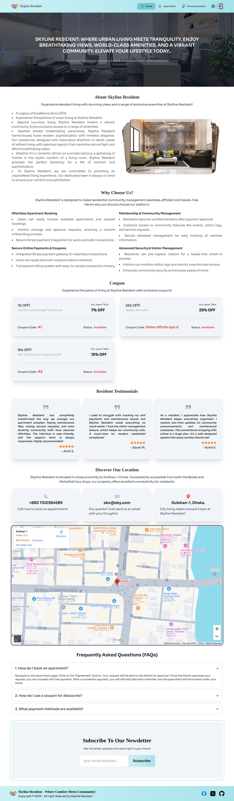
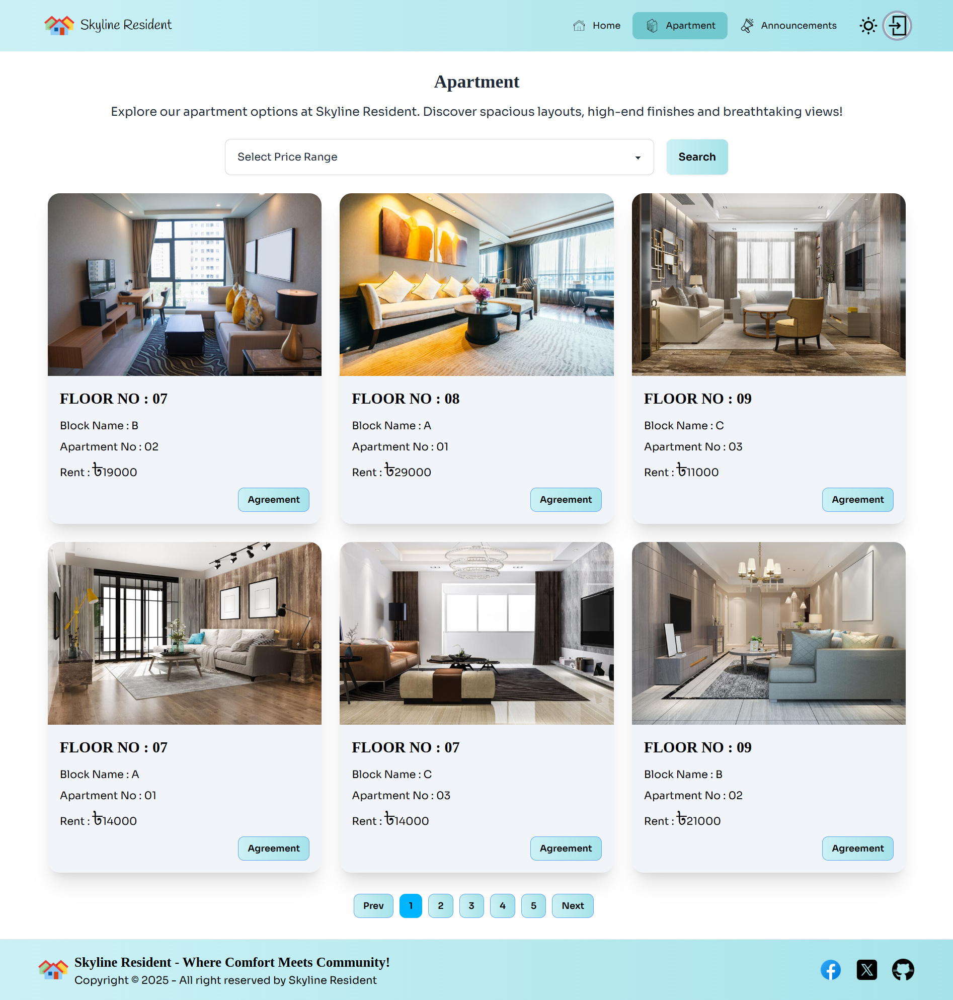
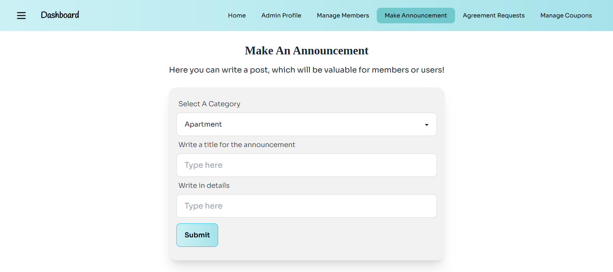

#  Skyline Resident✨

## Project Name: Skyline Resident

### A brief description: 
- Skyline Resident is a comprehensive building management platform designed to streamline the management and operations of a residential building. The system supports three user roles—Admin, Member, and User—each with distinct access levels and functionalities.
 

---

### Purpose:

- The purpose of the Skyline Resident project is to create an efficient, user-friendly platform for managing residential buildings by streamlining tenant interactions, administrative tasks, and resource allocation, fostering seamless collaboration between administrators, members and users. The Admin Dashboard empowers administrators to efficiently manage members, review agreement requests, and handle coupon creation. Admins can also make important announcements and oversee the entire building management process. The Member Dashboard provides members with access to rent payments, payment history, and announcements, ensuring seamless tenant interactions. Users, on the other hand, can explore available apartments and submit agreement requests for desired units.
  

### Main Key Features:

1. User Roles: Role-specific dashboards for Admin, Member and User- each tailored to their specific needs.

2. Apartment Listings: A searchable, paginated list of available apartments with detailed information, such as floor number, block name, rent, and more.

3. Agreement Management: Users can submit agreement requests, while admins can review and approve or reject them.

4. Payment System: Members can securely make rent payments with coupon code discounts and view their payment history.

5. Coupon Management: Admins can create, update, and manage coupon codes for rent discounts.

6. Announcements: Admins can post important announcements, visible to all members and users.

7. Authentication System: Secure login and registration with email and password, including social authentication (Google).

8. Responsive Design: Fully optimized for mobile, tablet, and desktop viewing.

9. Data Security: Sensitive configurations and credentials are secured using environment variables.

10. Interactive User Experience: Intuitive navigation, Framer Motion animations, and sweet alerts for feedback on user actions.

### Some NPM Packages I've Used On This Project:
- React-stripe-js: A React library for integrating Stripe's payment processing features into web applications. It provides components and hooks to securely handle payment methods and streamline the checkout process.
- Tanstack/React-Table: Tanstack/React-Table is a powerful and flexible data table library for React. It provides a robust and customizable foundation for building interactive and performant data tables with features like sorting, filtering, pagination, and more.
- Axios: Axios is a popular promise-based HTTP client for the browser and Node.js. It simplifies making HTTP requests, such as GET, POST, PUT, and DELETE, and handles JSON responses automatically.
- Framer-Motion: Framer-Motion is an animation library for React that provides a declarative and performant way to create stunning motion effects for your components. It offers features like spring physics, gesture interactions, and layout animations.
- Swiper.JS: Swiper is a free and open-source JavaScript library for creating touch-enabled sliders and carousels. It is highly customizable and supports various features like autoplay, loop, and lazy loading.

### Dependencies:
- @stripe/react-stripe-js: ^3.1.1
- @stripe/stripe-js: ^5.5.0
- @tanstack/react-query: ^5.64.1
- axios: ^1.7.9
- firebase: ^11.1.0
- localforage: ^1.10.0
- match-sorter: ^8.0.0
- motion: ^11.18.0
- react: ^19.0.0-rc.1
- react-dom: ^19.0.0-rc.1
- react-hook-form: ^7.54.2
- react-router-dom: ^7.1.1
- sort-by: ^1.2.0
- sweetalert2: ^11.15.10
- swiper: ^11.2.1

### How to run on local machine?

1. Open your terminal or command prompt.

2. Use the git clone command followed by the repository URL:-  git clone 'repository-url'

- Replace 'repository-url' with the actual URL of the Git repository you want to clone.

3. To run the project: Navigate to the project directory:- cd 'directory-name' 

4. Run 'npm install' to install project dependencies.

5. Environment setup:Create a '.env.local' file and put your firebase environment variable there. Save the following variable:
- VITE_apiKey='YOUR_FIREBASE_API_KEY'
- VITE_authDomain='YOUR_FIREBASE_AUTH_DOMAIN'
- VITE_projectId='YOUR_FIREBASE_PROJECT_ID'
- VITE_storageBucket='YOUR_FIREBASE_STORAGE_BUCKET'
- VITE_messagingSenderId='YOUR_FIREBASE_MESSAGING_SENDER_ID'
- VITE_appId='YOUR_FIREBASE_APP_ID'
- VITE_Payment_Gateway_PK='YOUR_STRIPE_ID'

6. Run 'npm run dev' to run the project locally.

## Credential for login to Admin Dashboard-

- Admin Email: admin@gmail.com
- Admin Password: Admin123

###

##  Live Link: 
### Surge : [Skyline Resident](https://skyline-resident-rrishiddh.surge.sh)
### Netlify : [Skyline Resident](https://skyline-resident-rrishiddh.netlify.app/)

### 
##  GitHub Repo Link: 
###  Server Side : [https://github.com/Programming-Hero-Web-Course4/b10a12-server-side-rrishiddh](https://github.com/Programming-Hero-Web-Course4/b10a12-server-side-rrishiddh)

##  Site Preview: 
 

  
   
  
   
  
   
  
   
  
   
  
   
  

### 

